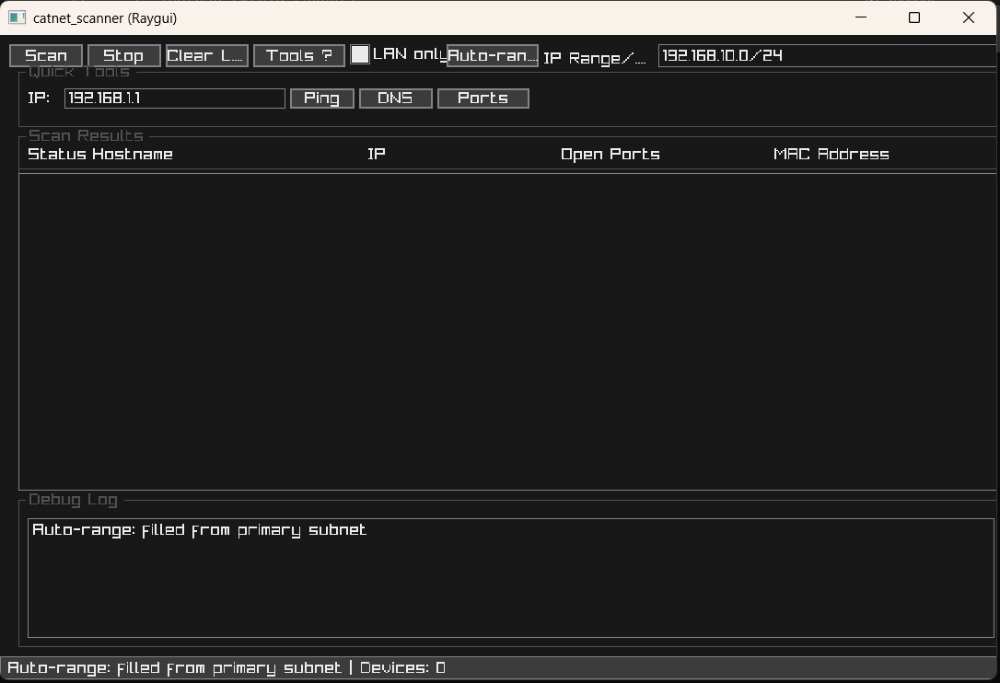

# CatNet Scanner (GUI)

CatNet Scanner is a Windows network scanner with a graphical UI built using Raygui (raylib).

## Highlights

- Parallel scan engine for responsive UI and faster discovery.
- CIDR support in `IP Range/CIDR` with an `Auto-range` helper.
- Quick Tools: `Ping`, `DNS`, and `Ports` for a single IP.
- Filtered results: only alive devices are listed by default.
- LAN-only toggle to constrain scanning to the primary subnet.
- Responsive columns and resizable window.
- Status bar and debug log with clearer progress reporting.

## Features

- Scan local subnet and custom IP ranges (CIDR notation supported).
- Identify devices: ICMP ping, reverse DNS, MAC via ARP.
- Check common TCP open ports (configurable list).
- Export results to a text file.

## Screenshot

Screenshots are stored under `docs/screenshots/` and referenced here. Add a
current UI screenshot at `docs/screenshots/ui-v0.2.png` and it will be linked
below.



## Build (Windows, Clang)

### Compile

```
powershell -ExecutionPolicy Bypass -File build.ps1 -Compiler Clang
```

Produces `bin\catnet_scanner.exe`.

Notes:
- Uses `clang-cl` for compilation and `lld-link` (or `link.exe`) for linking.
- If Visual Studio Build Tools are installed, the script can auto-activate the environment for Windows SDK headers/libs.
- Requires network privileges to send ICMP (ping) and ARP on Windows.

### Run

```
bin\catnet_scanner.exe
```

## Usage Notes

- The GUI is created programmatically in `src\main_raygui.c`.
- MAC via ARP works only on the same subnet; ping uses ICMP; ports are checked via non-blocking TCP.
- Results list currently shows alive devices; total found count appears in the status bar.
- Use `LAN only` to restrict scans to your primary subnet.

## Third-Party and Acknowledgements

- Uses `raylib` and `raygui` as Git submodules:
  - raylib: https://github.com/raysan5/raylib
  - raygui: https://github.com/raysan5/raygui
- Huge thanks to the authors and contributors of raylib and raygui.

## Submodules (how to clone and update)

Clone the repository with submodules:

```
git clone --recursive https://github.com/mendsec/catnet_scanner.git
```

If you already cloned without `--recursive`, initialize and update submodules:

```
git submodule update --init --recursive
```

To update submodules to the latest upstream changes and record them in the parent repo:

```
# Check out default branch for each submodule and pull
git submodule foreach "git checkout main || git checkout master"
git submodule foreach "git pull --ff-only"

# Record new submodule commits in the parent repository
git add third_party/raylib third_party/raygui
git commit -m "Update submodules"
git push
```

## .github (purpose and practical use)

The `.github` folder contains templates that streamline collaboration on GitHub:

- Issue templates: provide structured forms for reporting bugs and requesting features, ensuring key details (steps to reproduce, expected behavior, environment, motivation) are captured consistently.
- Pull Request template: guides contributors to describe changes, affected components, and validation steps, and to update docs or scripts when needed. This reduces review friction and improves traceability.
- Issue config: disables blank issues and points users to the documentation for build and usage information, helping keep reports actionable.

Practical benefits:
- Faster triage and clearer communication between maintainers and contributors.
- More consistent and complete reports, leading to fewer back-and-forths.
- Better documentation hygiene by reminding contributors to update docs alongside code changes.

How to use:
- On GitHub, when opening an Issue or PR, the corresponding template appears automatically. Fill it in with concise, relevant information.
- Maintainers use the provided structure to reproduce issues, validate fixes, and assess impact, improving the reliability of the development workflow.

## Changelog

See `docs/RELEASE_NOTES_v0.2.0.md` for the latest changes and upgrade notes.